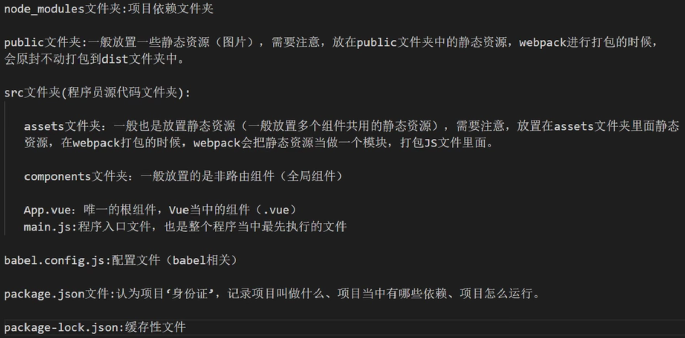
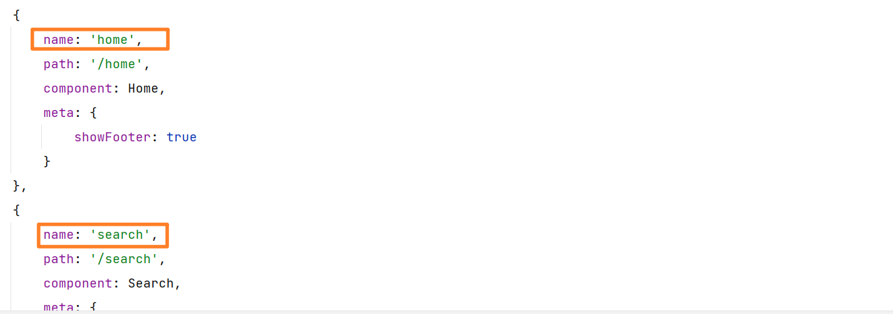
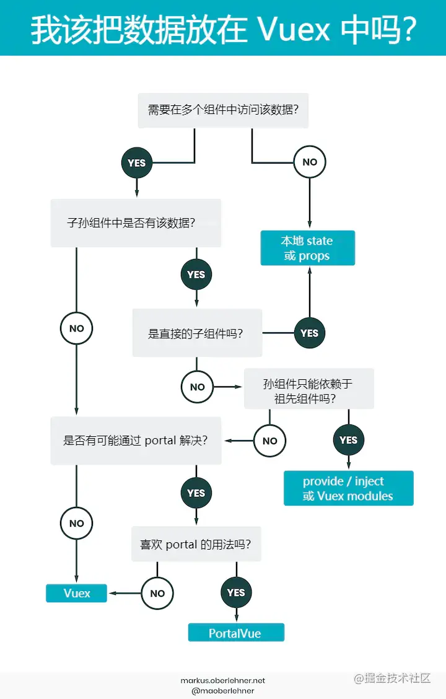
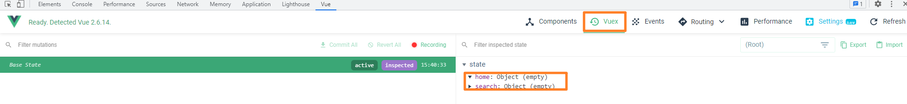
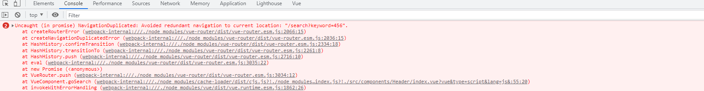

# sph-app

## Project setup
```
npm install
```

### Compiles and hot-reloads for development
```
npm run serve
```

### Compiles and minifies for production
```
npm run build
```

### Lints and fixes files
```
npm run lint
```

### Customize configuration
See [Configuration Reference](https://cli.vuejs.org/config/).

## 项目介绍

## 基础知识补充

### 项目配置

> 项目结构说明



> 配置启动项目时打开游览器

修改 `package.json` 文件，添加 **--open** 配置项

```json
"scripts": {
    "serve": "vue-cli-service serve --open",
    ...
}
```

> 关闭 eslint

创建 `vue.config.js` 文件，添加以下配置

```js
module.exports = {
    lintOnSave: false
}
```

> 配置别名

创建 `jsconfig.json` 文件，添加以下配置

```json
{
    "compilerOptions": {
        "baseUrl": "./",
        "paths": {
            "@/*": ["src/*"]
        }
    },
    "exclude": ["node_modules", "dist"]
}
```

### 安装 CSS 预编译处理器

> less

```powershell
npm install --save less less-loader@5
```

这里的 `less-loader` 选用 5.0 版本，因为高版本会报错

vue 组件中使用

```vue
<style lang="less" scoped>
```

### $route & $router

当 Vue 在 `main.js` 中注册 **router** 后

```javascript
new Vue({
  render: h => h(App),
  router
}).$mount('#app')
```

无论是 路由组件/非路由组件 都会获得两个属性：

- **$route**：用来获取路由信息(params/query等)
- **$router**：用来进行编程式路由导航(push/repiace等)

### 编程式导航的正确使用姿势

字符串 / 模板字符串 -> ×

现在 `router/index.js` 中为每个路由组件配置 `name`



在组件中用 `this.$router.push` 配置相关 **params**(需要配置占位符) / **query**

```javascript
this.$router.push({
    name: 'search', // 设置要跳转路由的 name
    query: {        // 配置要传递的 query 参数
        keyword: this.keyword
    },
    params: {       // 配置要传递的 params 参数，注意，如果需要使用 params 需要配置对应的占位符
        k: this.keyword
    }
})
```

> 面试题

1. 编程式导航(对象写法)中 **path** 属性无法与 **params** 属性结合使用

   ```javascript
   this.$router.push({
       path: '/search',
       params: {
           
       }
   })
   // 报错
   ```

2. 配置路由时如何指定 **params** 可传可不传

   ```json
   {
       name: 'home',
       path: '/home/:keyword', // 
       component: Home,
       meta: {
           showFooter: true
       }
   },
   ```

   **进行路由跳转如果不指定 params，URL 会出现问题**，可以在占位符后面加上一个 **?** 表示这个 params 可传可不传

   ```json
   {
       name: 'home',
       path: '/home/:keyword?', 
       component: Home,
       meta: {
           showFooter: true
       }
   },
   ```

3. params 参数可传/可不传的情况下，如果传递的是一个空字符串，也会出现 **URL** 问题

   ```javascript
   this.$router.push({
       nane: 'search',
       params: {
           keyword: '' // 会出现 URL 问题
       }
   })
   ```

   可以通过 **undefined** 解决

   ```javascript
   this.$router.push({
       nane: 'search',
       params: {
           keyword: '' || undefined // 不会出现 URL 问题
       }
   })
   ```

4. 路由组件通过 **props** 传递参数

   使用布尔值 - 路由组件可以通过 **props** 属性获取 params 数据(**但不能获取 query 数据**)

   ```json
   {
       name: 'home',
       path: '/home/:keyword',
       component: Home,
       meta: {
           showFooter: true
       },
       // 路由组件可以通过 props 属性获取 params 数据
       props: true
   },
   ```

   对象写法 - 不好用

   ```json
   {
       name: 'home',
       path: '/home/:keyword',
       component: Home,
       meta: {
           showFooter: true
       },
       props: {
           a: 1,
           b: 2
       }
   },
   ```

   函数写法 - 最常用的就是这个(但其实路由组件传递 props 这种方式本身就很少用)

   ```json
   {
       name: 'home',
       path: '/home',
       component: Home,
       meta: {
           showFooter: true
       },
       props: $router => ({
           keyword: $router.params.keyword,
           k: $router.query.k
       })
   },
   ```

### Vuex 模块式开发



vuex 基本概念：TODO

1. 在 `store` 目录下创建 `modules` 文件夹

2. 创建各自的模块对应的 `index.js` 文件

   

3. 在 JS 中配置相关属性

   ```javascript
   const state = {
   
   }
   
   const mutations = {
   
   }
   
   const actions = {
   
   }
   
   const getters = {
   
   }
   
   export default {
       state,
       mutations,
       actions,
       getters
   }
   ```

4. 在 `store/index.js` 中引入 vuex 并导入模块

   ```javascript
   import Vue from 'vue'
   import Vuex from 'vuex'
   // 先使用一次插件
   Vue.use(Vuex)
   
   import home from "./modules/home"
   import search from "./modules/search"
   
   export default new Vuex.Store({
       modules: {
           home,
           search
       }
   })
   ```

5. 查看 vue tools

   

> 别忘记在 `main.js` 中引入 store 哟

### Vue Bus 全局消息总线

```javascript
new Vue({
    render: h => h(App),
    // 配置全局消息总线
    beforeCreate() {
        Vue.prototype.$bus = this
    },
    router,
    store
}).$mount('#app')
```

> 使用

注册 & 销毁监听事件

```javascript
mounted() {
    this.$bus.$on('updateKeyword', newValue => this.keyword = newValue)
},
destroyed() {
    this.$bus.off('updateKeyword')
}
```

调用监听事件

```javascript
this.$bus.$emit('updateKeyword', this.searchObj.keyword);
```

## 业务逻辑扩展

### 重写 push & replcae 方法

> 可以不重写，对业务没有任何影响

对于 **编程式导航** 如果重复跳转到同一个路由就会出现 **NavigationDuplicated** 错误



原因: vue-router 底层使用的 **Promise** 由于没有传入 `reslove` 和 `reject` 函数，导致错误未被捕获

解决方法：

1. 传入 `resolve`  和 `reject` 函数

   ```javascript
   goSearch() {
       this.$router.push({
           name: 'search', // 设置要跳转路由的 name,
           query: {        // 配置要传递的 query 参数
               keyword: this.keyword
           }
       },() => {}, () => {})
   }
   ```

   缺点：不方便，每个 **push** 都要写

2. 重写 `VueRouter.prototype` 原型对象中的方法

   ```javascript
   const originPush = VueRouter.prototype.push;
   const originReplace = VueRouter.prototype.replace;
   
   VueRouter.prototype.push = function (options, reject, resolve) {
       // 这里的 this 是 VueRouter 的实例
       if (reject && resolve) {
           originPush.call(this, options, reject, resolve)
       } else {
           originPush.call(this, options, () => {}, () => {})
       }
   }
   VueRouter.prototype.replace = function (options, reject, resolve) {
       if (reject && resolve) {
           originReplace.call(this, options, reject, resolve)
       } else {
           originReplace.call(this, options, () => {}, () => {})
       }
   }
   ```

### Axios 二次封装

目的：设置 **请求拦截器** 和 **响应拦截器** 在请求之前和响应之后能够先进行相关业务逻辑的处理

```javascript
import axios from "axios"

// 配置 axios
const requests = axios.create({
    // 接口基础路径
    baseURL: '/api',
    // 请求超时
    timeout: 5000
})

// 配置请求拦截器
requests.interceptors.request.use(config => {
    return config;
})

// 配置响应拦截器
requests.interceptors.response.use(
    // 服务器成功响应
    (res) => {
        return res.data
    },
    // 服务器失败响应
    (error) => {
        return Promise.reject(new Error("faild"))
    }
)

export default requests
```

### Webpack 代理解决跨域

跨域的概念: TODO

跨域的解决方法：JSONP / CORS / 代理

在 `webpack.config.js` / `vue.config.js` 文件中进行相关配置

```js
module.exports = {
    //...
    devServer: {
        proxy: {
            // 当发送 '/api' 请求时就会通过指定的代理服务器(http://39.98.123.211)发送请求
            '/api': {
                target: 'http://39.98.123.211'
            }
        }
    }
};
```

### nprogress 请求进度条

> 安装 nprogres

```powershell
npm install --save nprogress
```

> 使用

1. 在 `request.js` 中引入

   ```javascript
   import nprogress from 'nprogress'
   // 引入 nprogress 样式
   import 'nprogress/nprogress.css'
   ```

2. 在拦截器中开启和关闭进度条

   ```javascript
   request.interceptors.request.use(config => {
       // 开启进度条
       nprogress.start();
       ...
   })
   
   request.interceptors.response.use(
       (res) => {
           // 关闭进度条
           nprogress.done();
           return res.data
       },
       // 服务器失败响应
       ...
   )
   ```

> 修改进度条颜色

打开 `node_modules/nprogress/nprogress.css`

```css
#nprogress .bar {
    background: linear-gradient(to right, #fa709a 0%, #fee140 100%);
    ...
}
```

修改 `background` 属性即可

### 函数防抖与节流

卡顿现象：事件触发非常频发，而且每一次触发回调函数都要执行，如果时间很短，而回调函数内部有计算，那么很可能出现游览器卡顿

深入函数防抖与节点：TODO

#### 函数防抖

理解：前面的所有的触发都被取消，最后一次执行在规定的时间之后才会触发，也就是说如果连续快速的触发，只会执行一次

原理：闭包 + 延迟器

#### 函数节流

理解：只有在指定间隔内不会重复触发回调，只有大于这个时间间隔后才会触发回调，把**频繁触发变为少量触发**(给游览器充足的时间解析代码)

原理：闭包 + 延迟器

#### 项目中使用

Lodash JS 库使用：https://www.lodashjs.com/

1. 按需引入需要使用的功能函数

   ```javascript
   import throttle from 'lodash/throttle'
   ```

2. 在 `method` 中使用

   ```javascript
   changeIndex: throttle(function (index) {
       this.currentIndex = index
   }, 50)
   ```

### Mock 模拟测试数据

应用场景：无需等待后端开发完接口，根据接口文档编写相关格式数据后，即可在前端本地进行测试，提高开发效率

官网：https://github.com/nuysoft/Mock/wiki

学习笔记：TODO

使用：

1. 安装 mock

   ```powershell
   npm install --save mockjs
   ```

2. 在 `src` 下创建 `mock`文件夹，根据接口文档，创建对应的 JSON 数据文件

   JSON 文件的数据格式应该和接口文档的一样

   ```json
   [
       {
           "id": "1",
           "imgUrl": "/images/banner1.jpg"
       },
       {
           "id": "2",
           "imgUrl": "/images/banner2.jpg"
       },
       {
           "id": "3",
           "imgUrl": "/images/banner3.jpg"
       },
       {
           "id": "4",
           "imgUrl": "/images/banner4.jpg"
       }
   ]
   ```

3. 创建 `mock/index.js` 文件

   ```javascript
   import Mock from 'mockjs'
   
   // 引入 JSON 数据文件, webpack 在进行打包时会默认暴露 JSON 文件，所以不需要额外配置暴露
   import banners from './banners.json'
   import floors from './floors.json'
   
   // 配置 mock 数据
   Mock.mock('/mock/banner', banners)
   Mock.mock('/mock/floor', floors)
   ```

4. 在 `main.js` 中引入

   ```javascript
   // 引入 mock 数据
   import '@/mock'
   ```

PS：如果模拟的数据中带有 img 这种静态资源，要先将对应的资源放在 `public/images` 文件夹中

### Swiper 轮播图插件使用

swiper：一个专门用于对触摸滑动效果进行处理的插件; 

官网：https://www.swiper.com.cn/

使用：

1. 安装 swiper

   ```powershell
   npm i --save swiper@5
   ```

2. 在 `main.js` 中引入 CSS 样式

   ```javascript
   // 引入 swiper 样式
   import 'swiper/css/swiper.min.css'
   ```

3. 在需要使用 swiper 的组件中引入对应的 JS 库

   ```javascript
   import Swiper from 'swiper'
   ```

4. 使用初始化 Swiper

   ```javascript
   var mySwiper = new Swiper ('.swiper', {
       direction: 'vertical', // 垂直切换选项
       loop: true, // 循环模式选项
   
       // 如果需要分页器
       pagination: {
           el: '.swiper-pagination',
       },
   
       // 如果需要前进后退按钮
       navigation: {
           nextEl: '.swiper-button-next',
           prevEl: '.swiper-button-prev',
       },
   
       // 如果需要滚动条
       scrollbar: {
           el: '.swiper-scrollbar',
       },
   })  
   ```

   参考配置：https://www.swiper.com.cn/api/index.html

### Watch + $nextTick 解决异步语句渲染问题

问题：许多 JS 插件库都是需要操作 DOM 元素的，但在 Vue 中存在单纯的 `mounted()` 是不等待异步语句的加载的(例如 v-for 等)，如果在 `mounted()` 中调用对应的 JS 插件库操作异步 DOM，这时候是**无法生效**，因为 DOM 元素还没有被加载出来

解决：**Watch + $nextTick**

大体思路：利用 `watch` 监听异步数据，在异步数据更新之后调用 `$nextTick` 回调函数，该回调会在异步数据对应的异步 DOM 更新之后执行

> $nextTick: 在下次 DOM 更新循环结束之后执行延迟回调。在修改数据之后立即使用这个方法，获取更新后的 DOM。

```javascript
watch: {
    // 配置监听
    bannerList: function() {
        // $nextTick: 在下次 DOM 更新循环结束之后执行延迟回调。在修改数据之后立即使用这个方法，获取更新后的 DOM。
        this.$nextTick(() => {
            // swiper 需要在 DOM 元素渲染之后再执行才能生效
            var mySwiper = new Swiper ('.swiper-container', {
                loop: true, // 循环模式选项

                // 如果需要分页器
                pagination: {
                    el: '.swiper-pagination',
                    clickable: true
                },

                // 如果需要前进后退按钮
                navigation: {
                    nextEl: '.swiper-button-next',
                    prevEl: '.swiper-button-prev',
                },
            })
    	})
    }
}
```

### Vue Router 滚动行为

官方文档：https://router.vuejs.org/zh/guide/advanced/scroll-behavior.html#%E5%BC%82%E6%AD%A5%E6%BB%9A%E5%8A%A8

作用：可以跳转 vue 进行路由跳转后新页面的滚动条位置

使用：在 `router/index.js` 中进行相关配置

```javascript
export default new VueRouter({
    routes,
    // 配置 vue router 滚动行为
    scrollBehavior(to, from, savedpPosition) {
        return {y: 0}
    }
})
```

## 性能优化

1. 目标：全局组件中的数据获取一次即可

   原因：对于全局组件中所需要的数据，不建议在对应的全局组件的 `mounted()` 生命周期时获取，因为全局组件在 SPA 单页应用中，`mounted()` 会被执行多次，导致向服务器发送过多的无效请求

   解决思路：在 **SPA** 单页应用环境中, **App.vue** 将作为根组件，其 `mounted()` 生命周期函数只会被执行一次，在通过 Vuex 进行数据管理，全局组件中只用获取 Vuex state 中保存的数据即可

   ```javascript
   mounted() {
       // 获取全局组件中的需要的数据，避免多次发出请求(通过 Vuex 发送异步请求，将数据保存到 state )
       this.$store.dispatch('getCategoryList')
   }
   ```

   

   
