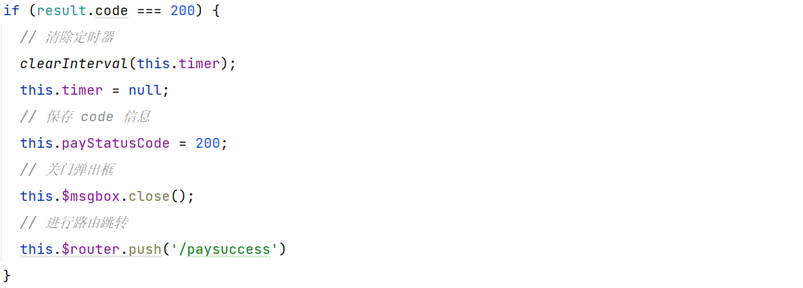
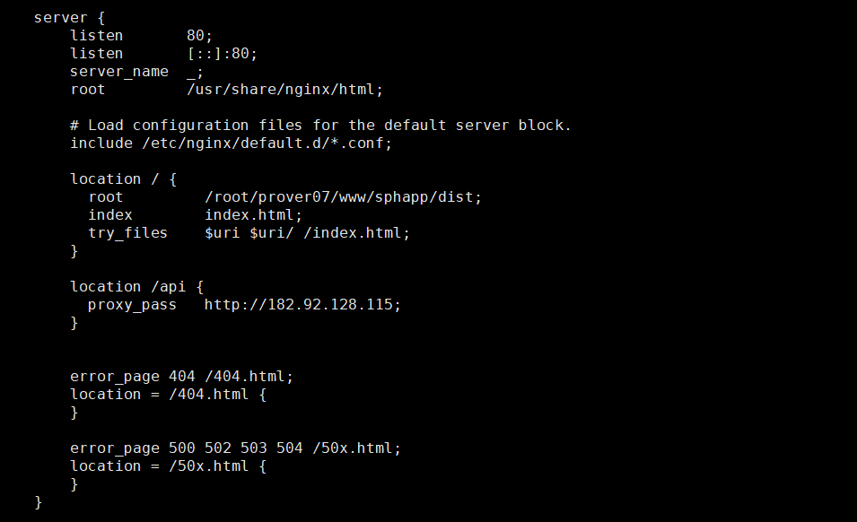
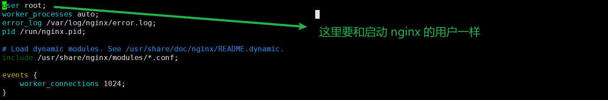

# sph-app

## 项目介绍

简介：基于 Vue2 全家桶搭建的电商平台系统

项目地址：http://121.4.203.127/#/home

仓库地址：https://github.com/Dreamer-07/sph-app

技术点：

- Vue2
- VueRouter
- Vuex
- Axios
- Element UI
- Mock
- Swiper
- QRcode(微信支付二维码)
- Vee Validate
- Webpack
- Nginx
- Nprogress

## 基础知识补充

### 项目配置

> 项目结构说明


> 配置启动项目时打开游览器

修改 `package.json` 文件，添加 **--open** 配置项

```json
"scripts": {
    "serve": "vue-cli-service serve --open",
    ...
}
```

> 关闭 eslint

创建 `vue.config.js` 文件，添加以下配置

```js
module.exports = {
    lintOnSave: false
}
```

> 配置别名

创建 `jsconfig.json` 文件，添加以下配置

```json
{
    "compilerOptions": {
        "baseUrl": "./",
        "paths": {
            "@/*": ["src/*"]
        }
    },
    "exclude": ["node_modules", "dist"]
}
```

### 安装 CSS 预编译处理器

> less

```powershell
npm install --save less less-loader@5
```

这里的 `less-loader` 选用 5.0 版本，因为高版本会报错

vue 组件中使用

```vue
<style lang="less" scoped>
```

### $route & $router

当 Vue 在 `main.js` 中注册 **router** 后

```javascript
new Vue({
  render: h => h(App),
  router
}).$mount('#app')
```

无论是 路由组件/非路由组件 都会获得两个属性：

- **$route**：用来获取路由信息(params/query等)
- **$router**：用来进行编程式路由导航(push/repiace等)

### 编程式导航的正确使用姿势

字符串 / 模板字符串 -> ×

现在 `router/index.js` 中为每个路由组件配置 `name`


在组件中用 `this.$router.push` 配置相关 **params**(需要配置占位符) / **query**

```javascript
this.$router.push({
    name: 'search', // 设置要跳转路由的 name
    query: {        // 配置要传递的 query 参数
        keyword: this.keyword
    },
    params: {       // 配置要传递的 params 参数，注意，如果需要使用 params 需要配置对应的占位符
        k: this.keyword
    }
})
```

> 面试题

1. 编程式导航(对象写法)中 **path** 属性无法与 **params** 属性结合使用

   ```javascript
   this.$router.push({
       path: '/search',
       params: {
           
       }
   })
   // 报错
   ```

2. 配置路由时如何指定 **params** 可传可不传

   ```json
   {
       name: 'home',
       path: '/home/:keyword', // 
       component: Home,
       meta: {
           showFooter: true
       }
   },
   ```

   **进行路由跳转如果不指定 params，URL 会出现问题**，可以在占位符后面加上一个 **?** 表示这个 params 可传可不传

   ```json
   {
       name: 'home',
       path: '/home/:keyword?', 
       component: Home,
       meta: {
           showFooter: true
       }
   },
   ```

3. params 参数可传/可不传的情况下，如果传递的是一个空字符串，也会出现 **URL** 问题

   ```javascript
   this.$router.push({
       nane: 'search',
       params: {
           keyword: '' // 会出现 URL 问题
       }
   })
   ```

   可以通过 **undefined** 解决

   ```javascript
   this.$router.push({
       nane: 'search',
       params: {
           keyword: '' || undefined // 不会出现 URL 问题
       }
   })
   ```

4. 路由组件通过 **props** 传递参数

   使用布尔值 - 路由组件可以通过 **props** 属性获取 params 数据(**但不能获取 query 数据**)

   ```json
   {
       name: 'home',
       path: '/home/:keyword',
       component: Home,
       meta: {
           showFooter: true
       },
       // 路由组件可以通过 props 属性获取 params 数据
       props: true
   },
   ```

   对象写法 - 不好用

   ```json
   {
       name: 'home',
       path: '/home/:keyword',
       component: Home,
       meta: {
           showFooter: true
       },
       props: {
           a: 1,
           b: 2
       }
   },
   ```

   函数写法 - 最常用的就是这个(但其实路由组件传递 props 这种方式本身就很少用)

   ```json
   {
       name: 'home',
       path: '/home',
       component: Home,
       meta: {
           showFooter: true
       },
       props: $router => ({
           keyword: $router.params.keyword,
           k: $router.query.k
       })
   },
   ```

### Vuex 模块式开发


vuex 基本概念：TODO

1. 在 `store` 目录下创建 `modules` 文件夹

2. 创建各自的模块对应的 `index.js` 文件

   

3. 在 JS 中配置相关属性

   ```javascript
   const state = {
   
   }
   
   const mutations = {
   
   }
   
   const actions = {
   
   }
   
   const getters = {
   
   }
   
   export default {
       state,
       mutations,
       actions,
       getters
   }
   ```

4. 在 `store/index.js` 中引入 vuex 并导入模块

   ```javascript
   import Vue from 'vue'
   import Vuex from 'vuex'
   // 先使用一次插件
   Vue.use(Vuex)
   
   import home from "./modules/home"
   import search from "./modules/search"
   
   export default new Vuex.Store({
       modules: {
           home,
           search
       }
   })
   ```

5. 查看 vue tools

   

> 别忘记在 `main.js` 中引入 store 哟

### Vue Bus 全局消息总线

```javascript
new Vue({
    render: h => h(App),
    // 配置全局消息总线
    beforeCreate() {
        Vue.prototype.$bus = this
    },
    router,
    store
}).$mount('#app')
```

> 使用

注册 & 销毁监听事件

```javascript
mounted() {
    this.$bus.$on('updateKeyword', newValue => this.keyword = newValue)
},
destroyed() {
    this.$bus.off('updateKeyword')
}
```

调用监听事件

```javascript
this.$bus.$emit('updateKeyword', this.searchObj.keyword);
```

### try catch - async await Promise

通过 axios 发送请求时，会返回 **Promise** 对象，可以在方法名前加上 `async` 内部使用 `await` 快速获取 promise 对象中的值

```javascript
async addShopCart({commit}, {skuId, skuNum}) {
    let result = await productApi.addShopCart(skuId, skuNum);
}
```

根据 `result` 判断这次业务的执行是否成功，返回 `Promise.resolve` / `Promise.reject`

```javascript
async addShopCart({commit}, {skuId, skuNum}) {
    let result = await productApi.addShopCart(skuId, skuNum);
    if (result.code === 200) {
        return Promise.resolve('success');
    } else {
        return Promise.reject("faild")
    }
}
```

在外层调用处可以通过 `try...catch` 进行相关处理

```javascript
try {
    // 调用 vuex 中的 action
    await this.$store.dispatch("addShopCart", {
        skuId: this.$route.params.skuId,
        skuNum: this.skuNum
    })
    ...
} catch (error) {
    console.error(error.message)
}
```

### 按需加载 element-ui 

1. 安装 `element-ui`

   ```powershell
   npm install --save element-ui
   ```

2. 安装 ` babel-plugin-component`(按需引入)

   ```powershell
   npm install babel-plugin-component -D
   ```

3. 配置 `babel` 文件

   - `.babelrc`

     ```
     {
         "presets": [["es2015", { "modules": false }]],
         "plugins": [
             [
                 "component",
                 {
                     "libraryName": "element-ui",
                     "styleLibraryName": "theme-chalk"
                 }
             ]
         ]
     }
     ```

   - `babel.config.js`

     ```js
     module.exports = {
         presets: [
             '@vue/cli-plugin-babel/preset'
         ],
         plugins: [
             [
                 "component",
                 {
                     "libraryName": "element-ui",
                     "styleLibraryName": "theme-chalk"
                 }
             ]
         ]
     }
     ```

4. 创建 `utils/element-ui.js` 文件，在这里统一配置需要引入的 element-ui 组件

   ```javascript
   import Vue from "vue";
   import {MessageBox} from "element-ui";
   
   Vue.prototype.$alert = MessageBox.alert
   ```

5. 在 `main.js` 引入

   ```javascript
   // 引入 element-ui
   import '@/utils/element-ui'
   ```

6. 根据注册组件的不同方式，在 Vue 中使用即可

### 自定义插件

 TODO: 挖坑

## 业务逻辑扩展

### 重写 push & replcae 方法

> 可以不重写，对业务没有任何影响

对于 **编程式导航** 如果重复跳转到同一个路由就会出现 **NavigationDuplicated** 错误


原因: vue-router 底层使用的 **Promise** 由于没有传入 `reslove` 和 `reject` 函数，导致错误未被捕获

解决方法：

1. 传入 `resolve`  和 `reject` 函数

   ```javascript
   goSearch() {
       this.$router.push({
           name: 'search', // 设置要跳转路由的 name,
           query: {        // 配置要传递的 query 参数
               keyword: this.keyword
           }
       },() => {}, () => {})
   }
   ```

   缺点：不方便，每个 **push** 都要写

2. 重写 `VueRouter.prototype` 原型对象中的方法

   ```javascript
   const originPush = VueRouter.prototype.push;
   const originReplace = VueRouter.prototype.replace;
   
   VueRouter.prototype.push = function (options, reject, resolve) {
       // 这里的 this 是 VueRouter 的实例
       if (reject && resolve) {
           originPush.call(this, options, reject, resolve)
       } else {
           originPush.call(this, options, () => {}, () => {})
       }
   }
   VueRouter.prototype.replace = function (options, reject, resolve) {
       if (reject && resolve) {
           originReplace.call(this, options, reject, resolve)
       } else {
           originReplace.call(this, options, () => {}, () => {})
       }
   }
   ```

### Axios 二次封装

目的：设置 **请求拦截器** 和 **响应拦截器** 在请求之前和响应之后能够先进行相关业务逻辑的处理

```javascript
import axios from "axios"

// 配置 axios
const requests = axios.create({
    // 接口基础路径
    baseURL: '/api',
    // 请求超时
    timeout: 5000
})

// 配置请求拦截器
requests.interceptors.request.use(config => {
    return config;
})

// 配置响应拦截器
requests.interceptors.response.use(
    // 服务器成功响应
    (res) => {
        return res.data
    },
    // 服务器失败响应
    (error) => {
        return Promise.reject(new Error("faild"))
    }
)

export default requests
```

### Webpack 代理解决跨域

跨域的概念: TODO

跨域的解决方法：JSONP / CORS / 代理

在 `webpack.config.js` / `vue.config.js` 文件中进行相关配置

```js
module.exports = {
    //...
    devServer: {
        proxy: {
            // 当发送 '/api' 请求时就会通过指定的代理服务器(http://39.98.123.211)发送请求
            '/api': {
                target: 'http://39.98.123.211'
            }
        }
    }
};
```

### nprogress 请求进度条

> 安装 nprogres

```powershell
npm install --save nprogress
```

> 使用

1. 在 `request.js` 中引入

   ```javascript
   import nprogress from 'nprogress'
   // 引入 nprogress 样式
   import 'nprogress/nprogress.css'
   ```

2. 在拦截器中开启和关闭进度条

   ```javascript
   request.interceptors.request.use(config => {
       // 开启进度条
       nprogress.start();
       ...
   })
   
   request.interceptors.response.use(
       (res) => {
           // 关闭进度条
           nprogress.done();
           return res.data
       },
       // 服务器失败响应
       ...
   )
   ```

> 修改进度条颜色

打开 `node_modules/nprogress/nprogress.css`

```css
#nprogress .bar {
    background: linear-gradient(to right, #fa709a 0%, #fee140 100%);
    ...
}
```

修改 `background` 属性即可

### 函数防抖与节流

卡顿现象：事件触发非常频发，而且每一次触发回调函数都要执行，如果时间很短，而回调函数内部有计算，那么很可能出现游览器卡顿

深入函数防抖与节点：TODO

#### 函数防抖

理解：前面的所有的触发都被取消，最后一次执行在规定的时间之后才会触发，也就是说如果连续快速的触发，只会执行一次

原理：闭包 + 延迟器

#### 函数节流

理解：只有在指定间隔内不会重复触发回调，只有大于这个时间间隔后才会触发回调，把**频繁触发变为少量触发**(给游览器充足的时间解析代码)

原理：闭包 + 延迟器

#### 项目中使用

Lodash JS 库使用：https://www.lodashjs.com/

1. 按需引入需要使用的功能函数

   ```javascript
   import throttle from 'lodash/throttle'
   ```

2. 在 `method` 中使用

   ```javascript
   changeIndex: throttle(function (index) {
       this.currentIndex = index
   }, 50)
   ```

### Mock 模拟测试数据

应用场景：无需等待后端开发完接口，根据接口文档编写相关格式数据后，即可在前端本地进行测试，提高开发效率

官网：https://github.com/nuysoft/Mock/wiki

学习笔记：TODO

使用：

1. 安装 mock

   ```powershell
   npm install --save mockjs
   ```

2. 在 `src` 下创建 `mock`文件夹，根据接口文档，创建对应的 JSON 数据文件

   JSON 文件的数据格式应该和接口文档的一样

   ```json
   [
       {
           "id": "1",
           "imgUrl": "/images/banner1.jpg"
       },
       {
           "id": "2",
           "imgUrl": "/images/banner2.jpg"
       },
       {
           "id": "3",
           "imgUrl": "/images/banner3.jpg"
       },
       {
           "id": "4",
           "imgUrl": "/images/banner4.jpg"
       }
   ]
   ```

3. 创建 `mock/index.js` 文件

   ```javascript
   import Mock from 'mockjs'
   
   // 引入 JSON 数据文件, webpack 在进行打包时会默认暴露 JSON 文件，所以不需要额外配置暴露
   import banners from './banners.json'
   import floors from './floors.json'
   
   // 配置 mock 数据
   Mock.mock('/mock/banner', banners)
   Mock.mock('/mock/floor', floors)
   ```

4. 在 `main.js` 中引入

   ```javascript
   // 引入 mock 数据
   import '@/mock'
   ```

PS：如果模拟的数据中带有 img 这种静态资源，要先将对应的资源放在 `public/images` 文件夹中

### Swiper 轮播图插件使用

swiper：一个专门用于对触摸滑动效果进行处理的插件; 

官网：https://www.swiper.com.cn/

使用：

1. 安装 swiper

   ```powershell
   npm i --save swiper@5
   ```

2. 在 `main.js` 中引入 CSS 样式

   ```javascript
   // 引入 swiper 样式
   import 'swiper/css/swiper.min.css'
   ```

3. 在需要使用 swiper 的组件中引入对应的 JS 库

   ```javascript
   import Swiper from 'swiper'
   ```

4. 使用初始化 Swiper

   ```javascript
   var mySwiper = new Swiper ('.swiper', {
       direction: 'vertical', // 垂直切换选项
       loop: true, // 循环模式选项
   
       // 如果需要分页器
       pagination: {
           el: '.swiper-pagination',
       },
   
       // 如果需要前进后退按钮
       navigation: {
           nextEl: '.swiper-button-next',
           prevEl: '.swiper-button-prev',
       },
   
       // 如果需要滚动条
       scrollbar: {
           el: '.swiper-scrollbar',
       },
   })  
   ```

   参考配置：https://www.swiper.com.cn/api/index.html

### Watch + $nextTick 解决异步语句渲染问题

问题：许多 JS 插件库都是需要操作 DOM 元素的，但在 Vue 中存在单纯的 `mounted()` 是不等待异步语句的加载的(例如 v-for 等)，如果在 `mounted()` 中调用对应的 JS 插件库操作异步 DOM，这时候是**无法生效**，因为 DOM 元素还没有被加载出来

解决：**Watch + $nextTick**

大体思路：利用 `watch` 监听异步数据，在异步数据更新之后调用 `$nextTick` 回调函数，该回调会在异步数据对应的异步 DOM 更新之后执行

> $nextTick: 在下次 DOM 更新循环结束之后执行延迟回调。在修改数据之后立即使用这个方法，获取更新后的 DOM。

```javascript
watch: {
    // 配置监听
    bannerList: function() {
        // $nextTick: 在下次 DOM 更新循环结束之后执行延迟回调。在修改数据之后立即使用这个方法，获取更新后的 DOM。
        this.$nextTick(() => {
            // swiper 需要在 DOM 元素渲染之后再执行才能生效
            var mySwiper = new Swiper ('.swiper-container', {
                loop: true, // 循环模式选项

                // 如果需要分页器
                pagination: {
                    el: '.swiper-pagination',
                    clickable: true
                },

                // 如果需要前进后退按钮
                navigation: {
                    nextEl: '.swiper-button-next',
                    prevEl: '.swiper-button-prev',
                },
            })
    	})
    }
}
```

### Vue Router 滚动行为

官方文档：https://router.vuejs.org/zh/guide/advanced/scroll-behavior.html#%E5%BC%82%E6%AD%A5%E6%BB%9A%E5%8A%A8

作用：可以跳转 vue 进行路由跳转后新页面的滚动条位置

使用：在 `router/index.js` 中进行相关配置

```javascript
export default new VueRouter({
    routes,
    // 配置 vue router 滚动行为
    scrollBehavior(to, from, savedpPosition) {
        return {y: 0}
    }
})
```

### Vue Router 导航守卫

作用：又称为 **路由守卫**， 可以实时监控**路由跳转的过程**，简单理解就是路由跳转过程中的一些钩子函数

官方文档：https://router.vuejs.org/zh/guide/advanced/navigation-guards.html

#### 全局前置守卫 beforeEach

在路由跳转前触发，参数包括`to,from,next`三个，这个钩子作用主要是用于登录验证，也就是路由还没跳转提前告知，以免跳转了再通知就为时已晚。

```javascript
const router = new VueRouter({ ... })

router.beforeEach((to, from, next) => {
  // ...
})
```

#### 全局解析守卫 beforeResolve

也是在路由跳转前触发，参数也是 `to,from,next` 三个，和 **beforeEach** 区别在于只有在所有 **组件内守卫** 和 **异步路由组件** 被解析之后，解析守卫才会被调用

#### 全局后置守卫 afterEach

和 **beforeEach** 相反，只有在路由跳转完成后才会触发，参数中只有 `to, from`,发生在 `beforeEach` & `beforeResolve` 之后

#### 路由独享守卫

可以针对一个路由专门进行守卫配置，目前只有一个 `beforeEnter` 钩子函数

```javascript
const router = new VueRouter({
    routes: [
        {
            path: '/foo',
            component: Foo,
            beforeEnter: (to, from, next) => {
                // ...
            }
        }
    ]
})
```

`beforeEnter`和 `beforeEach` 完全相同，如果都设置则在 `beforeEach` 之后紧随执行，参数to、from、next

#### 组件内的守卫

类似于组件内的生命周期函数，包括 `beforeRouteEnter`、`beforeRouteUpdate`、`beforeRouteLeave` 

- `beforeRouteEnter`: 路由进入之前调用，参数包括 `to, from, next`，

  该钩子在全局守卫 `beforeEach` 和路由独享守卫 `beforeEnter` 之后，在全局 `beforeResolve` 和 `afterEach` 之前执行

  注意：守卫内访问不到组件的实例，也就是 `this` 为 `undefined` ，也就是他在beforeCreate生命周期前触发。在这个钩子函数中，可以通过传一个回调给 next来访问组件实例。

  ```javascript
  beforeRouteEnter (to, from, next) {
      // 这里还无法访问到组件实例，this === undefined
      next( vm => {
          // 通过 `vm` 访问组件实例
      })
  }
  ```

  

- `beforeRouteUpdate`: 在 当前路由改变(路由query变更)/该组件被复用时调用，可以通过 this 访问实例，

- `beforeRouteLeave`: 导航离开该组件时调用，可以访问组件实例this，参数包括to，from，next。

#### 总结

> 当切换路由时

1. beforeRouterLeave 											组件内守卫
2. beforeEach                                                           全局前置守卫
3. beforeEnter                                                          路由独享守卫
4. beforeRouteEnter                                               组件内守卫(进入路由之前，此时 this 还无法访问组件实例)
5. beforeResolve                                                      全局解析守卫
6. afterEach                                                               全局后置守卫
7. beforeCreate                                                        生命周期
8. created                                                                  生命周期
9. beforeMount                                                        生命周期
10. mounted                                                               生命周期
11. beforeRouteEnter的next的回调                        组件内守卫

> 当路由更新时

beforeRouteUpdate 

### 微信支付业务

> 生成对应的支付二维码

1. 安装 `qrcode`

   ```powershell
   npm install --save qrcode
   ```

2. 在需要生成二维码的地方使用，**toDateURL** 中应该传入后端返回的  **二维码地址**

   ```javascript
   // 打开微信支付
   async openWxPay() {
       // 加载微信支付二维码
       let url = await QRCode.toDataURL(this.payInfo.codeUrl)
   ```

> 通过定时器监听微信支付状态

1. 在显示微信二维码后，通过定时器回调函数查询支付状态

   ```javascript
   this.timer = setInterval(async () => {
             let result = await this.$api.payment.getPayStatus(this.$route.query.orderId)
   ```

2. 注意：应该根据查询 `result` 结果判断是否需要关闭定时器

   

### Vee Validate@2 表单验证

官方文档：https://github.com/logaretm/vee-validate

1. 安装依赖(因为3的不好用，先用2的就好了)

   ```powershell
   npm i vee-validate@2 --save
   ```

2. 创建 `pulgins/validate.js` 文件，在这里进行相关配置

   ```javascript
   import Vue from "vue";
   import VeeValidate from "vee-validate";
   // 引入中文包
   import zh_CN from 'vee-validate/dist/locale/zh_CN'
   
   Vue.use(VeeValidate)
   
   // 配置 VeeValidate 校验规则
   VeeValidate.Validator.localize('zh_CN', {
       // 配置提示消息体
       messages: {
           ...zh_CN.messages,
           is: (field) => `${field}必须要和密码相同`
       },
       // 配置属性
       attributes: {
           phone: '手机号',
           phoneCode: '验证码',
           password: '密码',
           checkPassword: '确认密码',
           isAggre: '协议'
       }
   })
   
   // 自定义校验规则
   VeeValidate.Validator.extend('aggre', {
       // 校验规则
       validate: value => value,
       // 错误信息
       getMessage: field => field + "必须同意"
   })
   ```

3. 在 `main.js` 中引入即可

   ```javascript
   // 引入 Vee-Validate
   import '@/plugins/validate'
   ```

4. 在 `.vue` 中配置校验规则

   ```html
   <!-- 通过 name 和 v-validate 指令配置校验规则 -->
   <input type="text" placeholder="请输入你的手机号" v-model="phone" name="phone"
          v-validate="{ required: true, regex: /^1\d{10}$/  }" :class="{ invalid: errors.has('phone') }">
   <span class="error-msg">{{ errors.first('phone') }}</span>
   
   
   
   <input type="password" placeholder="请输入你的登录密码" v-model="password" name="password"
          v-validate="{ required: true, regex: /^[0-9a-zA-Z]{8,20}$/ }" :class="{ invalid: errors.has('password') }"
          />
   <span class="error-msg">{{ errors.first('password') }}</span>
   
   <!-- is 表示与指定字段的值必须相同 -->
   <input type="password" placeholder="请输入确认密码" v-model="checkPassword" name="checkPassword"
          v-validate="{ required: true, is: password }" :class="{ invalid: errors.has('checkPassword') }">
   <span class="error-msg">{{ errors.first('checkPassword') }}</span>
   
   
   <input type="checkbox" v-model="isAggre" name="isAggre"
          v-validate="{ 'aggre': true }" :class="{ invalid: errors.has('isAggre') }">
   <span class="error-msg">{{ errors.first('isAggre') }}</span>
   ```

5. 在提交事件时进行统一判断

   ```javascript
   // 进行规则校验
   let isSuccess = await this.$validator.validateAll();
   if (isSuccess) {
   ```

### 打包上线

打包命令：`npm run build`

> 处理 .map 文件：打包后，会对 JS 文件压缩加密，.map 文件主要是为了线上运行如果报错方便找错误，但并不是很需要

打开 webpack 的配置文件，添加下列配置，这里 `vue.config.js`

```js
module.exports = {
    publicPath: './',
    // 关闭打包时生成 Map 文件
    productionSourceMap: false,
```

重新打包即可

> Nginx 反向代理

1. 安装 nginx

   ```powershell
   npm install nginx
   ```

2. 进入 `/etc/nginx` 文件夹下

   ```powershell
   cd /etc/nginx
   ```

3. 通过 Xftp 等相关工具，将 dist(打包后的项目) 放到 linux 上，注意路径：不要出现中文

4. 编辑 `nginx.conf`文件

   ```
   location / {
       root         /root/prover07/www/sphapp/dist; 
       index        index.html;
       try_files    $uri $uri/ /index.html;
   }
   
   location /api {
       proxy_pass http:182.92.128.115;
   }
   
   ```

   这里的  `root` 就是刚刚放项目的文件夹路径

   

5. 启动 nginx

   ```powershell
   systemctl start nginx
   ```

> Nginx 报错: nginx Permission denied



## 性能优化

### 全局组件重复请求数据

目标：全局组件中的数据获取一次即可

原因：对于全局组件中所需要的数据，不建议在对应的全局组件的 `mounted()` 生命周期时获取，因为全局组件在 SPA 单页应用中，`mounted()` 会被执行多次，导致向服务器发送过多的无效请求

解决思路：在 **SPA** 单页应用环境中, **App.vue** 将作为根组件，其 `mounted()` 生命周期函数只会被执行一次，在通过 Vuex 进行数据管理，全局组件中只用获取 Vuex state 中保存的数据即可

```javascript
mounted() {
    // 获取全局组件中的需要的数据，避免多次发出请求(通过 Vuex 发送异步请求，将数据保存到 state )
    this.$store.dispatch('getCategoryList')
}
```

### 懒加载

> 图片懒加载：https://github.com/hilongjw/vue-lazyload

1. 下载插件 `vue-lazylaod` 

   ```powershell
   npm install vue-lazyload --save
   ```

2. 在 `main.js` 中引入

   ```javascript
   // 引入默认图片
   import defaultImg from '@/assets/images/default.gif'
   // 引入 vue-lazyload
   import VueLazyload from "vue-lazyload";
   
   Vue.use(VueLazyload, {
       loading: defaultImg
   })
   ```

3. 在 `img` 标签中使用 `v-lazy` 指令

   ```html
   <router-link :to="`/detail/${good.id}`">
       
   </router-link>
   ```

> 路由懒加载

原因：当打包构建 Vue 项目时，JavaScript 包会变得非常大，会影响页面加载

解决：使用路由懒加载，当只有路由被访问时才会加载的组件，提高**效率**

使用：

1. Vue 异步组件(TODO)

2. ES 提出的 `import` 方法 -> 在 `router/index.js` 中修改配置

   ```javascript
   {
           name: 'center',
           path: '/center',
           // 使用路由懒加载
           component: () => import('@/pages/Center'),
   ```

   

### 注意事项

1. 尽量避免在生命周期钩子函数上使用 **async** 修饰

